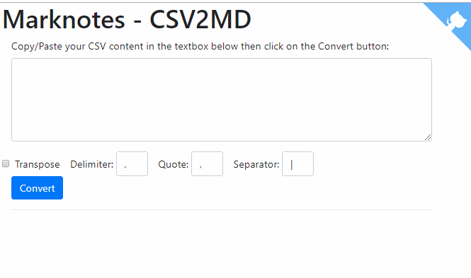

# marknotes_csv2md

CSV to markdown converter

Very straight-forward script for converting a CSV content to a Markdown table.

Convert string like

```text
Column 1 Header,Column 2 Header
Row 1-1,Row 1-2
Row 2-1,Row 2-2
```

into

```markdown
| Column 1 Header | Column 2 Header |
| --------------- | --------------- |
| Row 1-1         | Row 1-2         |
| Row 2-1         | Row 2-2         |
```

## How to use

Just copy/paste your CSV string into the text box as illustrated here below, choose your delimiter, quotation mark (let empty if none) and your separator (default is |).

When you've only two records in your csv, you can also activate the `Transpose` feature if you wish a two columns table.

When done, just press on the `Convert` button.



## Source

The `CSVTable` has been written by `Matthias Endler` and available on GitHub: https://github.com/mre/CSVTable.

The script has been modified for:

* Modified for PHP 7 compatibility
* Add a transpose feature
* Add the column separator as first / last character of the line
* Add a space before / after the column separator
* Add an interface for easily use the conversion tool
* HTML preview
